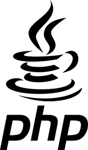

# PHPJava - JVM Emulator by PHP
[](https://github.com/dwyl/esta/issues)
 
[](https://travis-ci.org/memory-agape/php-java)
[](https://packagist.org/packages/memory-agape/php-java)
[](https://opensource.org/licenses/MIT)
<p align="center"></p>

# What is The PHPJava?
The PHPJava is experimental library which emulate JVM (a.k.a. Java Virtual Machine) by PHP 🐘
The PHPJava proceed to read binary from pre-compiled Java file(s) ☕
This project reference to [Java Virtual Machine Specification](https://docs.oracle.com/javase/specs/jvms/se11/html/index.html) documentation when We makes.

We welcoming to contributions this project 💪

## Requirements
- PHP >= 7.2
- Composer
- ext-zip

## Not currently supported
Sorry, I do not have enough time (T_T) 

- Inner classes
- Annotations
- Extends other class
- Implements
- Outer classes
- Event
- Java Archive
- double/float calculation.
- Many built-in libraries (ex. java.lang.xxx, java.io.xxx and so on) 
- etc...

## Get started

```
$ composer require memory-agape/php-java
```

### Get/Set a static fields
TBD

### Call a static method
TBD

### Get/Set a dynamic fields
TBD

### Call a dynamic method
TBD

### Output PHPJava operations
TBD

## PHP problems
TBD

## Run unit tests

```
./vendor/bin/phpunit tests
```

## Reference
- [Java Virtual Machine Specification](https://docs.oracle.com/javase/specs/jvms/se11/html/index.html)

## License
MIT